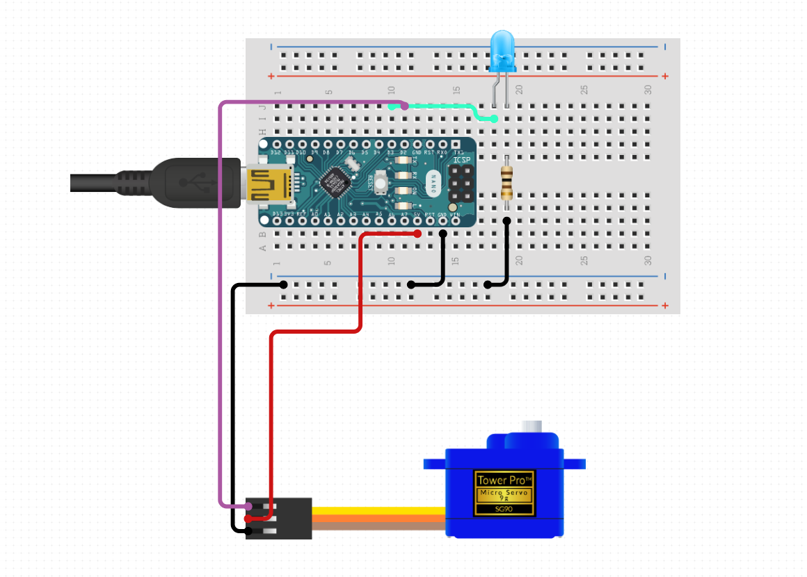

# Narada

This project is just for fun. It lets you show others that you are busy with an audio or video call by lifting a flag. Yes, a real flag. It works with Skype, Zoom, Teams, etc.

# Limitation
This project is designed for Linux users and has been tested on Ubuntu only.

# How to use

## Install
1. Build [Arduino device](#arduino-device)
2. Upload [device.ino](device/device.ino) to device (make sure to set correct pins for led and servo)
3. Plug in your device into USB port
4. Clone this repository 

`git clone https://github.com/igorzel/narada.git`

5. Check Arduino's Vendor and Product using `lsusb`, for example Vendor is `1a86` and Product is `7523`
6. Set Vendor and Product in [95-narada.rules](95-narada.rules) file
7. Locate Arduino device serial port in this directory `/dev/serial/by-id/`, for example it can be `/dev/serial/by-id/usb-1a86_USB2.0-Serial-if00-port0`
8. Set serial port in [narada.sh](narada.sh) and [narada.service](narada.service) files
9. Disconnect device from USB
10. Run

`sudo ./install.sh`

11. Plug in your device into USB port again
12. Make an audio or video call

## Uninstall
1. Disconnect device from USB
2. Run

`sudo ./uninstall.sh`

# How it works
The project consists of two components:
 -  A Bash script that runs on Linux and detects whether the microphone is in use or not and sends commands to Arduino device using serial port
 - An Arduino device that controls a servo motor to raise or lower a flag accordingly

## Linux part

### Bash script
[narada.sh](narada.sh) is a script that detects whether the microphone is in use or not.

High level logic:

1. Setup serial device using `stty`
2. Every 10 seconds check if any of microphone device is in _RUNNING_ state using `cat` and `grep`.

All the magic is here:

`cat /proc/asound/card?/pcm*c/sub0/status 2>/dev/null | grep -q "state: RUNNING"`

3. If any of the microphones is in _RUNNING_ state then send command `ON` to serial port, if not - send `OFF`

### systemd service
[narada.service](narada.service) systemd unit runs the bash script as a service. Service starts automatically when device is plugged in (see [udev](#udev)). After device is disconected service stops.

### udev
[95-narada.rules](95-narada.rules) is an udev rule to set permissions for Arduino serial device and start systemd unit service if device is plugged in.

## Arduino device

_drawn in [https://www.circuito.io/]()_

High level logic in [device.ino](device/device.ino):

1. Setup serial port
2. Set Led pin mode to OUTPUT
3. Listen to serial event
4. When command received attach servo
5. If command is `ON`:
    - Move servo to lift a flag with step 1 and delay
    - Set Led pin to `HIGH` to turn it on
6. If command is `OFF`:
    - Set Led pin to `LOW` to turn it off
    - Move servo to lower a flag with step 1 and delay
7. Detach servo

